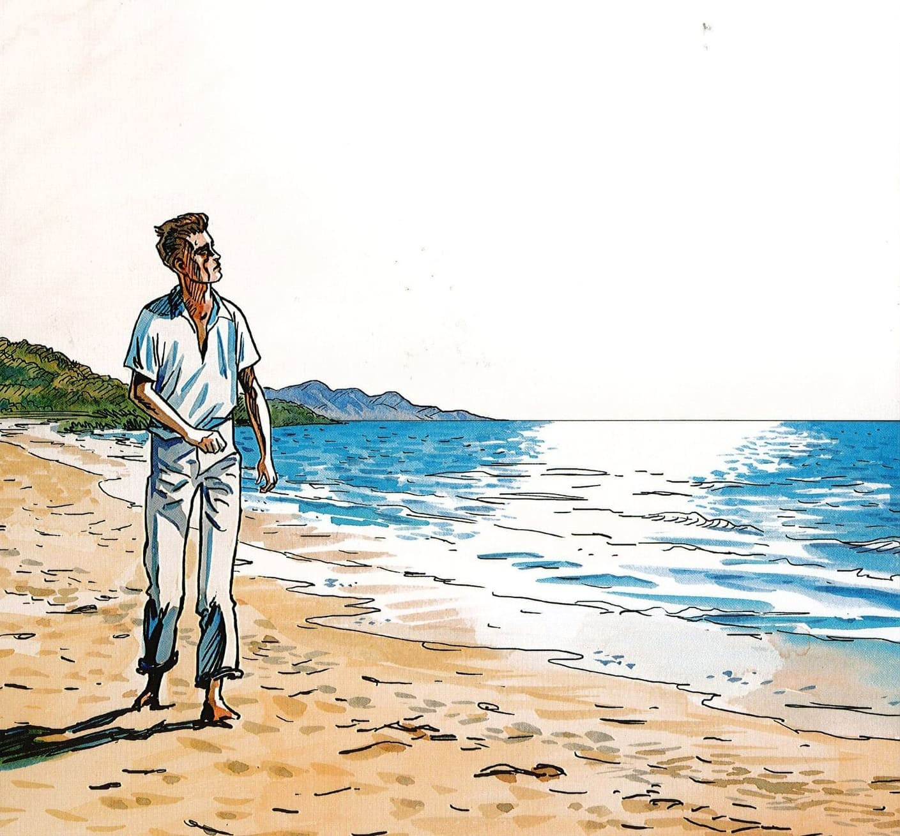

+++
title = "Comment Meursault reflète-t-il la société algérienne coloniale de l’époque ?"
date = "2025-02-13"
draft = false
pinned = false
image = "camus-couv-bd-1-3-.jpg"
footnotes = "Sources: \n\n* <https://www.erudit.org/fr/revues/etudfr/2020-v56-n2-etudfr05582/1072483ar/?utm>\n* <https://www.monde-diplomatique.fr/2000/11/SAID/2555?utm>\n* <https://www.histoire-immigration.fr/meursault-contre-enquete?utm>"
+++

**Meursault et la société coloniale en Algérie**

Albert Camus écrit *L’Étranger* en 1942. À cette époque, l’Algérie est une colonie de la France. Meursault est un homme différent. Il ne montre pas d’émotions. Il est froid, même quand sa mère meurt. Mais si on regarde bien, son caractère montre aussi des choses sur la société coloniale.

**Un monde divisé**

À l’époque, il y a deux groupes en Algérie : les Français et les Algériens. Les Français ont plus de droits. Les Algériens sont dominés. Meursault est Français, mais il est pauvre. Il vit simplement à Alger. Il ne profite pas trop du système colonial, mais il fait quand même partie. Il ne pense pas aux Arabes, ils sont presque invisibles dans le livre.

Un exemple : Meursault tue un Arabe, mais on ne sait presque rien sur lui. Il n’a pas de nom, pas d’histoire. C’est comme si il existait pas. Ça montre bien que les colons français ne voyaient pas vraiment les Algériens.

**L’indifférence de Meursault et le colonialisme**

Meursault ne se soucie de rien. Pas de la mort de sa mère, pas de Marie, pas du système colonial. Il ne pose pas de questions sur les injustices. Beaucoup de Français en Algérie faisaient pareil : ils ignoraient les problèmes des Algériens.

Mais en même temps, Meursault est aussi victime. Au procès, on le juge pas vraiment pour le meurtre, mais pour son attitude. Il devient un bouc émissaire. On le punit parce qu’il ne montre pas d’émotions comme les autres veulent.

**Meursault, un étranger dans tous les sens**

Aujourd’hui, on peut lire *L’Étranger* d’une autre façon. Camus critique peut-être la colonisation sans le dire directement. Meursault est un étranger dans la société, comme les colons étaient des étrangers en Algérie. Son indifférence fait penser aux Français qui ne regardent pas les Algériens.

Mais Meursault n’est pas seulement un reflet du colonialisme. Peut-être qu’il résiste aussi. Il refuse de mentir, il reste lui-même jusqu’à la fin. Il ne veut pas jouer le jeu de la société. Alors, il n’est pas juste un miroir du colonialisme, il est aussi un homme perdu dans un monde absurde.

Fun Facts sur le context historique:

1. L’Algérie était une colonie française depuis 1830, mais elle était considérée comme une partie de la France.
2. La colonisation créait des tensions : la France empêchait toute demande d’indépendance et réprimait durement les révoltes.
3. L’éducation était inégale : en 1954, seulement 10 % des Algériens musulmans savaient écrire en français, contre presque 100 % des Européens.
4. Albert Camus défendait les droits des Algériens, mais il ne croyait pas en une indépendance totale de l’Algérie.
5. Dans le Guerre et Résistance 1942– *L’Étranger* est publié l’année où les Alliés débarquent en Afrique du Nord (*Opération Torch*) et où Camus écrit contre les nazis dans la Résistance.
6. Camus travaille pour *Alger Républicain* et critique le colonialisme, mais le journal est interdit et il doit quitter l’Algérie.
7. En 1960, il meurt dans un accident de voiture, alors qu’il voulait prendre le train ; dans sa poche, il y avait le manuscrit inachevé de son prochain livre.